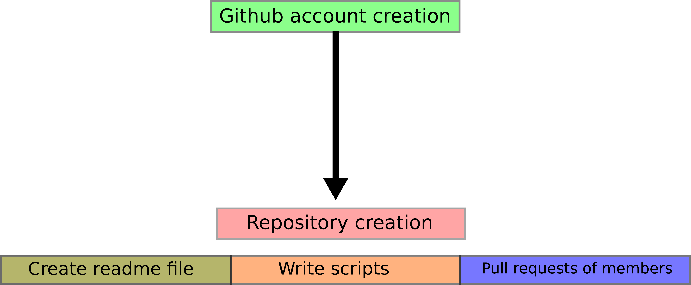

# team-curie-repository
## Hackbio-intership

Image rights are property of HackBio intership program.
This repository was created by team-curie.
## Process of design:

# Execution of BASH script
BASH script calls several scritps that were written in several languages as:
+ Perl (version 5.26)
+ Ruby (version 2.5.1p57)
+ Python (version 3.6)
+ Python (version 2.7)
+ BASH 
+ PHP (7.7.24)
+ Rscript (3.4.4)

In order to execute and obtain the csv file you must execute the central bash script, called **process.sh**, make sure you've installed versions of languages we used before execute it. If everything is installed you must obtain a csv file that can be opened in **Microsoft excel**.
